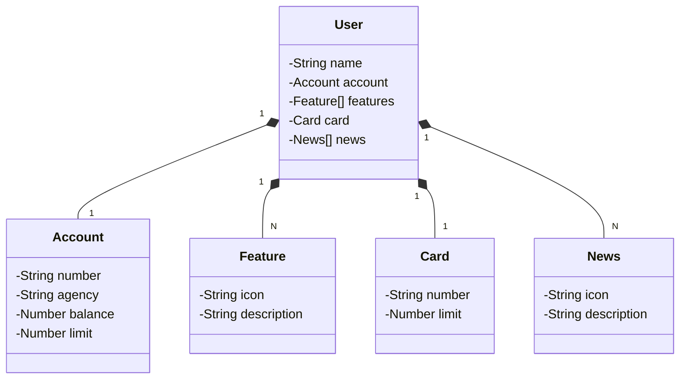

# dev-week-2024-api

Este Projeto Java RESTful API foi criada para a Dev Week.

## Principais Tecnologias

- **Java 21**: Utilizado a versão LTS mais recente do Java para tirar vantagem das últimas inovações que essa linguagem robusta e amplamente utilizada oferece;
- **Spring Boot 3**: Foi trabalhado com a mais nova versão do Spring Boot, que maximiza a produtividade;
- **Spring Data JPA**: Essa ferramenta simplifica nossa camada de acesso aos dados, facilitando a integração com bancos de dados SQL;

## Diagrama de Classes (Domínio da API)

